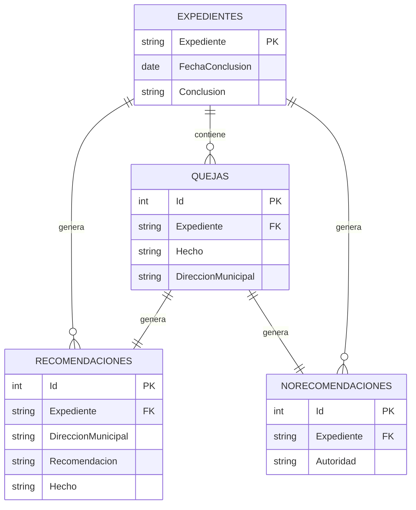

# Reporte EDA
Este notebook analiza desde una base de datos relacional en Access.
Hay 4 tablas Relacionadas. Hace análisis temporal y de tops autoridades, municipios o conclusiones de quejas en función del tiempo, etc.

## Conección a Access
Para realizar la conección con Access se utiliza la libreria `pyobdc` para utilizar los drivers de Microsoft Access, especificando el path del archivo de la base de datos y haciendo conectando con el comando `pyobdc.conect()` como se muestra a continuación:
```python
import pyobdc

conn_str = (
  r'Driver={Microsoft Access Driver (*.mdb, *.accdb)}'
  r'DBQ=' + '/path/file.mdb' + ';'
)

conn = pyobdc.conect(conn_str)
```
Se realizan las SQL Querys utilizando la librería de `pandas` por medio del comando `pd.read_sql()`. Finalmente se cierra la conección de pyobdc.

## Estructura de la Base de Datos SQL


## Preprocesamiento de Datos
### Dataframe Principal `df`
Una vez se cargaron las tablas `Quejas`, `Expediente`, `Recomendaciones` y `NoRecomendaciones`. Se realiza un INNER MERGE entre `Quejas` y `Expediente` utilizando como columna `Quejas.Expediente` y `Expediente.Expediente`.
```python
df = pd.merge(
    quejas,
    expediente,
    on='Expediente',
    how='inner',
    suffixes=('', '_expediente')
)
df = df[df['Expediente'].str.contains('/2025', na=False)]
df = df.sort_values(['FechaInicio', 'Expediente'])
df = df.reset_index(drop=True)
```
Se filtran los expedientes del 2025, se ordenan por la fecha de inicio y su número de expediente y finalmente se hace un reset al indice del dataframe. Siendo este nuestro dataframe principal que contiene relacion uno a varios entre las columnas.

### Dataframe Secundario `df2`
Este dataframe es generado a partir del dataframe principal, a excepción de que se eliminan los registros duplicados debido a las relaciones (1-N). Por lo que nos servirá para hacer conteos de expedientes unicos. Se genera utilizando el comando `.drop_duplicates()`.

## Resultados
Utilizando el comando `.drop_duplicates()` filtramos las columnas que requerimos para realizar conteos sobre algun parametro. Hacemos algunos filtros como lo son los filtros de municipios:
```python
conteo = df[['Expediente', 'DireccionMunicipal', 'Municipio']].drop_duplicates()
conteo = conteo[
    (conteo['Municipio'] != 'Estatal') & 
    (conteo['Municipio'] != 'Federal') & 
    ~conteo['Municipio'].str.startswith('autoridad', na=False) &
    ~conteo['Municipio'].str.startswith('Indet', na=False) &
    ~conteo['Municipio'].str.startswith('null', na=False) &
    conteo['Municipio'].notna()
]
```
En los cuales se descartan del conteo los registros que en la columna `Municipio` tienen la palabra _Estatal_, _Federal_, _Autoridad_, _Indet_, _null_ o que simplemente son nulos.
Finalmente se realiza el conteo, se muestran los primeros, o todos según la necesidad del usuario. Y se ordenan en orden descendente:
```
conteo = conteo['DireccionMunicipal'].value_counts().head(9)
conteo = conteo.sort_values(ascending=False)
```
Se realiza lo mismo pero variando los parámetros segun las necesidades y en algunas ocasiones se realizan gráficas de barras para visualizar los valores o gráficas de pasteles.
